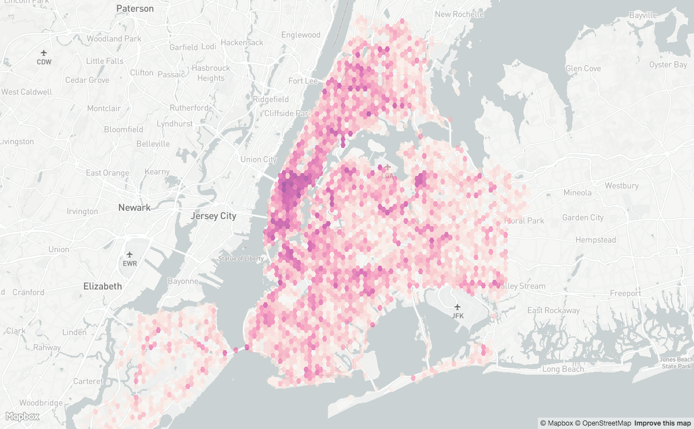

# GeoVisualization Workshop at iSchool


This repository contains the code for the workshop given at UC Berkeley's iSchool on 2017-04-10. It covers creating an interactive web map using [MapboxGL](https://www.mapbox.com/mapbox-gl-js/api/), [GeoJSON](http://geojson.org/), and [Turf](http://turfjs.org/).

[Link to the workshop slides](https://docs.google.com/presentation/d/1zJrk_NaD8NuH7_OP75ke27lAX9I0drC2Cd2RTHUEufE/edit?usp=sharing)

## TOC

- [00 HTML Template](./00_template/)
- [01 Create the Map and Load Some Data](./01_load_some_data/)
- [02 Add Data Driven Styling to Our Layer](./02_data_driven_styling/)
- [03 Add Hex Bins and a Jenks classification](./03_hex_bins/)
- [04 Add Custom Map Controls](./04_map_controls/)

We'll start by creating an interactive map using MapboxGL.JS and discussing adding a custom layer using some [GeoJSON data](./data/nyc_crashes.geojson) of vehicle collisions in New York City.

Next we'll style the data using a property from our GeoJSON and discuss potential issues that arise from overlapping point data.

We'll then look at one solution to aggregating point data using hexagonal binning with help from Turf.JS.

Finally we'll add some basic map controls for hiding and showing our map layers.

## Viewing the Examples
In order to view the examples locally on your computer, you'll need a web server. If you have Python accessible on your command line, `cd` to the root of this repo and do:

```
python -m SimpleHTTPServer 8000
```

Then open your web browser to `localhost:8000` and click one of the links above.

## About the Data
Data used in this workshop comes from the [NYC Open Data portal's vehicle collisions](https://data.cityofnewyork.us/Public-Safety/NYPD-Motor-Vehicle-Collisions/h9gi-nx95) for March, 2017. The data has been processed ahead of time for the sake of simplifying the number of steps necessary to create the visualizations in this workshop.
